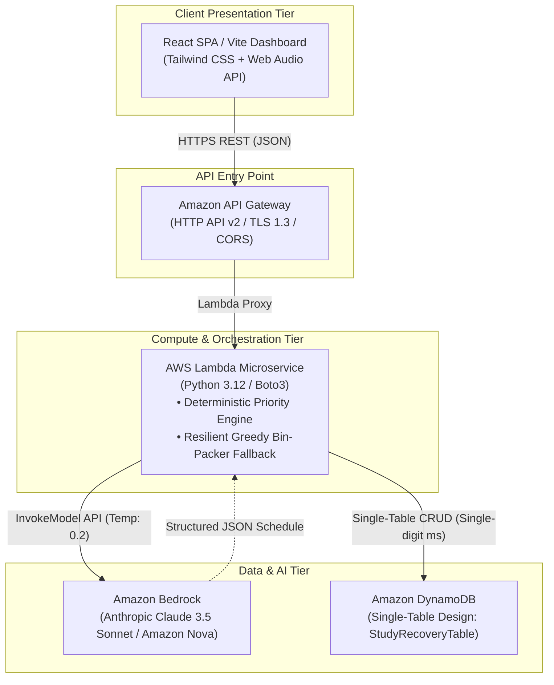

# Replan AI — Intelligent Study Recovery & Workload Rebalancer

<div align="center">

[](https://aws.amazon.com/)
[](https://aws.amazon.com/bedrock/)
[](https://aws.amazon.com/dynamodb/)
[](https://www.python.org/)
[](https://react.dev/)
[](https://tailwindcss.com/)
[](LICENSE)

<p align="center">
  <strong>Transform study planning from failure-induced anxiety into a resilient, guilt-free feedback loop.</strong><br>
  When disruptions occur, Replan AI recalculates available capacity, reprioritizes backlogs with mathematical precision, and generates feasible recovery schedules powered by Amazon Bedrock.
</p>

</div>

---

## 📌 Problem Statement

Students and self-directed learners face an inevitable operational reality: **static study timetables fail upon first contact with disruption**. 

An unexpected college lab, a challenging programming bug, fatigue, or personal emergencies cause schedules to slip. Conventional planners and to-do lists offer no dynamic recourse—unfinished items accumulate into an intimidating backlog, causing **"replanning paralysis"** and procrastination fueled by guilt.

### The Replan AI North Star
Shift from rigid schedule enforcement to **continuous, guilt-free recovery**. When a session is missed, one click absorbs the disruption, recalculates remaining workload against actual capacity, and outputs an immediately executable recovery schedule.

---

## 🏗️ System Architecture

Replan AI is engineered with a **100% Serverless, Event-Driven Architecture** on AWS, guaranteeing sub-second response times, single-digit millisecond data queries, zero idle compute costs, and resilient failover.



---

## ✨ 5 Core Functional Specifications (PRD & TRD)

### 1. FR-01: Task & Constraint Ingestion
- Ingests task metadata: **Title**, **Category** (*College Exam*, *Lab / Assignment*, *LeetCode / DSA*, *Project / System Design*, *Coding*), **Deadline** (ISO 8601), **Importance Weight** ($1–3$), **Subjective Difficulty** ($1–5$), and **Estimated Duration** (mins).
- Captures real-time daily available study capacity via an intuitive interactive slider ($1–8\text{ hours}$).

### 2. FR-02: Deterministic Priority Engine
To eliminate LLM hallucinations in task prioritization, ordering is computed deterministically in Lambda before constructing Bedrock prompts:

$$\text{PriorityScore} = (0.45 \times \text{UrgencyScore}) + (0.35 \times \text{ImportanceWeight}) + (0.20 \times \text{DifficultyFactor})$$

- **$\text{UrgencyScore}$**: $\max(0, 100 - (\text{HoursUntilDeadline} \times 1.25))$ (Tasks due $< 24\text{h}$ score $70–100$)
- **$\text{ImportanceWeight}$**: $\text{High}(3) \to 100 \mid \text{Medium}(2) \to 60 \mid \text{Low}(1) \to 25$
- **$\text{DifficultyFactor}$**: $\text{Difficulty} \times 20$ (Higher difficulty receives earlier slot allocation when fresh)
- **Tiers**: **Critical** ($\ge 75$), **Primary** ($45–74$), **Deferrable** ($< 45$)

### 3. FR-03: Bedrock AI Recovery Schedule Generation
- **Cognitive Load Bounds**: Strictly enforces **maximum 90-minute focus blocks**; splits longer tasks.
- **Mandatory 15-Minute Reset Breaks**: Inserts cognitive recovery intervals (*"Hydrate, rest eyes, and stretch; avoid digital screens"*).
- **Smart Deferrals**: If remaining workload exceeds available hours, lower-priority tasks are placed into a dedicated **"Smart Deferred"** section for the next window with zero guilt.
- **Strict JSON Contract**: System instructions enforce validated, predictable JSON output.

### 4. FR-04: Dynamic Progress Tracking & Telemetry
- Single-click checkboxes to mark tasks `COMPLETED`, `IN_PROGRESS`, or `MISSED`.
- Real-time KPI telemetry cards: **Available Study Time**, **Active Backlog**, **Completed Work**, and **Focus Efficiency %**.

### 5. FR-05: 1-Click Adaptive Replanning (Hero Feature)
- When a disruption occurs (e.g., lab ran overtime, roadblock encountered, fatigue), the student clicks **"Adapt Schedule"**.
- Recalculates remaining workload against new capacity, preserves hard exam deadlines, defers low-urgency items, and delivers a clean **Plan v2+** recovery timeline without manual timetable reconstruction.

---

## 🗄️ DynamoDB Single-Table Schema (`StudyRecoveryTable`)

All application entities reside in a single table partitioned for high-performance sub-10ms queries:

| Entity | Partition Key (PK) | Sort Key (SK) | Core Attributes |
|---|---|---|---|
| **Task Item** | `USER#<userId>` | `TASK#<taskId>` | `title` (S), `category` (S), `deadline` (S), `importance` (N), `difficulty` (N), `estMinutes` (N), `status` (S), `loggedMinutes` (N), `createdAt` (S) |
| **Daily Context** | `USER#<userId>` | `CONTEXT#<date>` | `availableMinutes` (N), `preferredTimeWindow` (M), `energyLevel` (S: HIGH\|NORMAL\|LOW), `updatedAt` (S) |
| **Recovery Plan** | `USER#<userId>` | `PLAN#<date>#v<ver>` | `version` (N), `timeBlocks` (L of Maps: `startTime`, `endTime`, `durationMinutes`, `title`, `isRest`), `deferredTasks` (L of S), `recoverySummary` (S), `generatedAt` (S) |

---

## 🔌 API Gateway REST Specifications

| Method | Endpoint | Description | Status & Response Contract |
|---|---|---|---|
| `POST` | `/tasks` | Create study task & compute priority | `201 Created`: `{ taskId, status: 'PENDING', task: TaskItem }` |
| `GET` | `/tasks` | Query tasks (`userId`, `status=all\|pending`) | `200 OK`: `{ tasks: [ TaskItem, ... ] }` |
| `PATCH` | `/tasks/{id}` | Update status & logged minutes | `200 OK`: `{ taskId, updatedStatus, loggedMinutes }` |
| `POST` | `/plan/generate` | Generate initial recovery plan | `200 OK`: `{ planId, version: 1, timeBlocks: [], deferredTasks: [] }` |
| `POST` | `/plan/replan` | 1-click adaptive disruption recovery | `200 OK`: `{ planId, version: 2+, timeBlocks: [], isReplan: true }` |

---

## 🛡️ Reliability & Fault Tolerance Strategy

1. **Bedrock Throttling & Timeout Fallback**: If Amazon Bedrock is unreachable or times out within 5 seconds, AWS Lambda engages a **deterministic greedy bin-packing fallback scheduler** that slots tasks strictly by `PriorityScore`. Guaranteed **zero 500 crashes**.
2. **Malformed JSON Sanitization**: Raw model responses pass through a regex JSON extractor and strict validation schema.
3. **Dual-Mode Client Resiliency**: The frontend includes automatic fallback caching to `localStorage`. If offline or running without a backend, the complete scheduling loop functions in-browser.

---

## 🚀 Deployment Guide

### Option 1: Deploy Frontend to Vercel (Recommended — 2 Minutes)

[](https://vercel.com/new/clone?repository-url=https://github.com/OmLNGupta/Replan-AI)

#### Via Vercel Web Dashboard:
1. Go to [vercel.com](https://vercel.com) and log in with GitHub.
2. Click **Add New** → **Project** and select `OmLNGupta/Replan-AI`.
3. Set **Root Directory** to `frontend`.
4. Framework Preset will auto-detect **Vite**.
5. Click **Deploy**. Your live URL will be active in seconds!

#### Via Vercel CLI:
```bash
cd frontend
npm install -g vercel
vercel
# Follow prompts (Select Root Directory: ./, Framework: Vite)
vercel --prod
```

---

### Option 2: Deploy Frontend to AWS Amplify

1. Open the [AWS Amplify Console](https://console.aws.amazon.com/amplify).
2. Choose **Host web app** and connect your GitHub repository `OmLNGupta/Replan-AI`.
3. Select the `main` branch.
4. Set App Root to `frontend`.
5. Amplify auto-detects Vite build settings:
   ```yaml
   frontend:
     phases:
       preBuild:
         commands:
           - npm ci
       build:
         commands:
           - npm run build
     artifacts:
       baseDirectory: dist
       files:
         - '**/*'
   ```
6. Click **Save and Deploy**. CloudFront CDN distribution will be configured automatically.

---

### Option 3: Deploy Serverless Backend to AWS (AWS SAM)

Prerequisites: [AWS CLI](https://aws.amazon.com/cli/) and [AWS SAM CLI](https://docs.aws.amazon.com/serverless-application-model/latest/developerguide/install-sam-cli.html).

```bash
cd backend

# Build Lambda microservice
sam build

# Deploy to your AWS Account (Creates API Gateway, Lambda, DynamoDB & IAM roles)
sam deploy --guided
```

When prompted:
- **Stack Name**: `replan-ai-backend`
- **AWS Region**: `us-east-1` (or your preferred Bedrock-enabled region)
- **Confirm changes before deploy**: `Y`
- **Allow SAM CLI IAM role creation**: `Y`

Once deployed, SAM outputs the public `HttpApiUrl` (e.g. `https://xyz.execute-api.us-east-1.amazonaws.com`).

---

## 💻 Local Development Setup

### 1. Prerequisites
- **Node.js**: v18+ (tested on v24)
- **Python**: 3.10+ (tested on Python 3.12 / 3.14)

### 2. Run Backend Simulator (Port 8000)
```bash
cd backend
python -m pip install -r requirements.txt

# Run automated tests
python test_backend.py

# Start local API Gateway simulator
python server.py
```
*Server runs on `http://127.0.0.1:8000`.*

### 3. Run Frontend (Port 3000)
```bash
cd frontend
npm install
npm run dev
```
*Open `http://localhost:3000` in your browser.*

---

## 📂 Repository Structure

```
Replan-AI/
├── frontend/                     # React 18 + Vite + Tailwind CSS SPA
│   ├── src/
│   │   ├── components/
│   │   │   ├── Header.tsx            # Clean SaaS navigation with tabs & online badge
│   │   │   ├── QuickStats.tsx        # 4 KPI cards (Capacity, Backlog, Completed, Efficiency)
│   │   │   ├── HeroBanner.tsx        # 1-click "Adapt Schedule" hero action card
│   │   │   ├── ScheduleTimeline.tsx  # Chronological focus blocks, 15m breaks & smart deferrals
│   │   │   ├── CapacityControl.tsx   # 1-8h study window slider & quick actions
│   │   │   ├── TaskBacklog.tsx       # Filterable task table with priority badges & status
│   │   │   ├── TaskModal.tsx         # Add task modal with live priority math preview
│   │   │   ├── AdaptModal.tsx        # Disruption handler & recovery schedule rebalancer
│   │   │   └── AnalyticsView.tsx     # Productivity & cognitive rules compliance stats
│   │   ├── lib/
│   │   │   ├── api.ts                # Dual-mode API client (Server & LocalStorage fallback)
│   │   │   ├── priority.ts           # Deterministic priority engine implementation
│   │   │   └── audio.ts              # Pure Web Audio API synthesizer (no audio assets)
│   │   ├── types/                    # TypeScript interfaces matching TRD specs
│   │   ├── App.tsx                   # Main dashboard application
│   │   └── index.css                 # Clean SaaS light-theme design system
│   ├── package.json
│   ├── vite.config.ts
│   ├── tailwind.config.js
│   ├── vercel.json                   # Zero-config Vercel deployment spec
│   └── tsconfig.json
├── backend/                      # 100% Serverless AWS Backend
│   ├── lambda/
│   │   └── app.py                    # Lambda handler: DynamoDB CRUD, Priority Math, Bedrock
│   ├── server.py                     # Python standard library API Gateway emulator
│   ├── test_backend.py               # Automated unit tests (100% passing)
│   ├── template.yaml                 # AWS SAM CloudFormation infrastructure template
│   └── requirements.txt              # boto3, botocore, pydantic
├── docs/
│   ├── PRD.md                        # Product Requirement Document (FR-01 to FR-05)
│   ├── TRD.md                        # Technical Requirement Document & Architecture Spec
│   └── DEMO_SCRIPT.md                # 3-minute pitch & live judging presentation script
├── vercel.json                       # Root Vercel deployment config
├── netlify.toml                      # Netlify deployment config
├── LICENSE                           # MIT License
└── README.md                         # Product Documentation
```

---

## 👥 Engineering & Architecture

- **Om Laxmi Narayan Gupta** — Lead Architect & Full-Stack Development
- **Target Event**: AWS First Commit (Bharat Builds Tour)

---

## 📄 License

This project is licensed under the MIT License - see the [LICENSE](LICENSE) file for details.
